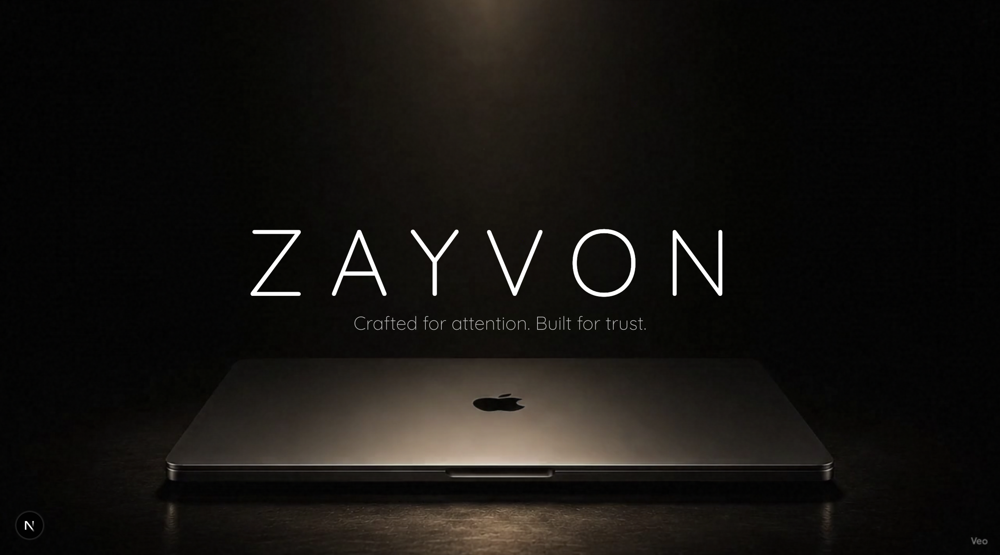

# ZAYVON Digital Studio

> Crafted for attention. Built for trust.

ZAYVON is a premium digital development agency specializing in immersive, high-performance web experiences, SaaS products, and AI applications. This repository contains the source code for the official ZAYVON digital presence.



## Architecture & Tech Stack

This project is built with a focus on cinematic motion, instantaneous load times, and enterprise-grade SEO.

- **Framework**: [Next.js 14](https://nextjs.org/) (App Router)
- **Styling**: [Tailwind CSS](https://tailwindcss.com/)
- **Animation**: [GSAP](https://gsap.com/) (ScrollTrigger & ScrollToPlugin)
- **Deployment**: [Vercel](https://vercel.com/)
- **Typography**: Inter & Quicksand (via `next/font`)
- **Metadata**: Next.js Metadata API & Dynamic `ImageResponse`

## Local Development

1. Clone the repository and install dependencies:
```bash
npm install
```

2. Run the development server:
```bash
npm run dev
```

3. Open [http://localhost:3000](http://localhost:3000) with your browser to see the result.

## Production Build

To verify the production build locally (including static site generation and Turbopack optimizations):

```bash
npm run build
npm run start
```

## Structure

- `src/components/cinematic-intro`: The immersive, video-driven hero section.
- `src/components/product-explorer`: The interactive, GSAP-pinned portfolio showcase.
- `src/components/seo`: JSON-LD Structured Data components.
- `src/app/api`: Serverless API routes (e.g., Resend email integration).
- `public/`: Static assets, video backgrounds, and SEO verification files.

## License

© 2026 ZAYVON Digital Studio. All rights reserved. Built in Kerala, India.
